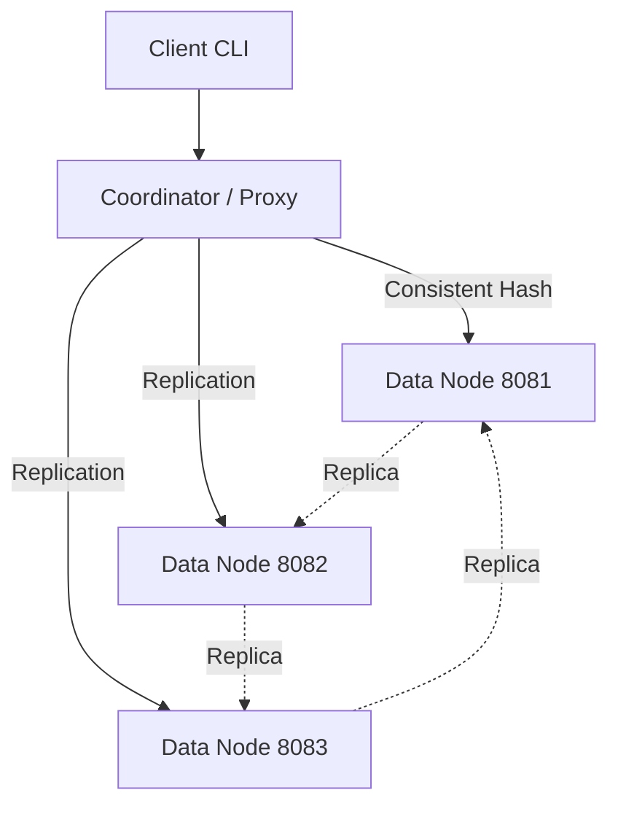

# Distributed Key-Value Store

A distributed, thread-safe key-value store written in Go. It supports **Sharding** (Consistent Hashing) and **Replication** (Fault Tolerance) to ensure high availability and scalability.

## Features

- **Core Storage**: Thread-safe in-memory storage using `sync.RWMutex`.
- **Networking**: HTTP/JSON API for easy interaction.
- **Sharding**: Data is partitioned across multiple nodes using **Consistent Hashing** (Ring Topology).
- **Replication**: Data is replicated to **3 nodes** (Primary + 2 Successors).
- **Fault Tolerance**:
  - **Quorum Writes (W=2)**: Writes are confirmed only if at least 2 replicas succeed.
  - **Read Failover**: Automatically retries replicas if the primary node is down.
- **Client SDK**: Go client and CLI tool included.

## Architecture

The system consists of a **Coordinator (Proxy)** and multiple **Data Nodes**.



## Getting Started

### Prerequisites
- Go 1.21+

### Installation
Clone the repository:
```bash
git clone https://github.com/RS-Adi/key-val.git
cd key-val
```

### Build Binaries
```bash
go build -o bin/server ./cmd/server
go build -o bin/proxy ./cmd/proxy
go build -o bin/client ./cmd/client
```

## Usage

### 1. Start the Cluster
Start 3 data nodes and the proxy.

**Terminal 1 (Node 1):**
```bash
./bin/server -port=8081
```

**Terminal 2 (Node 2):**
```bash
./bin/server -port=8082
```

**Terminal 3 (Node 3):**
```bash
./bin/server -port=8083
```

**Terminal 4 (Proxy):**
```bash
./bin/proxy
```

### 2. Run Client Commands
Use the CLI to interact with the cluster via the Proxy (port 8000).

**Set a Key:**
```bash
./bin/client -server http://localhost:8000 set mykey myvalue
# Output: OK
```

**Get a Key:**
```bash
./bin/client -server http://localhost:8000 get mykey
# Output: myvalue
```

### 3. Fault Tolerance Test (Chaos)
Test the system's resilience by killing a node.

1. Write a key: `./bin/client -server http://localhost:8000 set chaos_key works`
2. **Kill Node 8081** (Ctrl+C in Terminal 1).
3. Read the key: `./bin/client -server http://localhost:8000 get chaos_key`
   - **Result**: The Proxy will automatically fetch the data from a replica (Node 8082 or 8083).

## Project Structure

- `cmd/server`: Data Node entrypoint.
- `cmd/proxy`: Coordinator/Proxy entrypoint.
- `cmd/client`: CLI Client.
- `internal/store`: In-memory storage engine.
- `internal/server`: HTTP server logic.
- `pkg/client`: Client SDK library.
